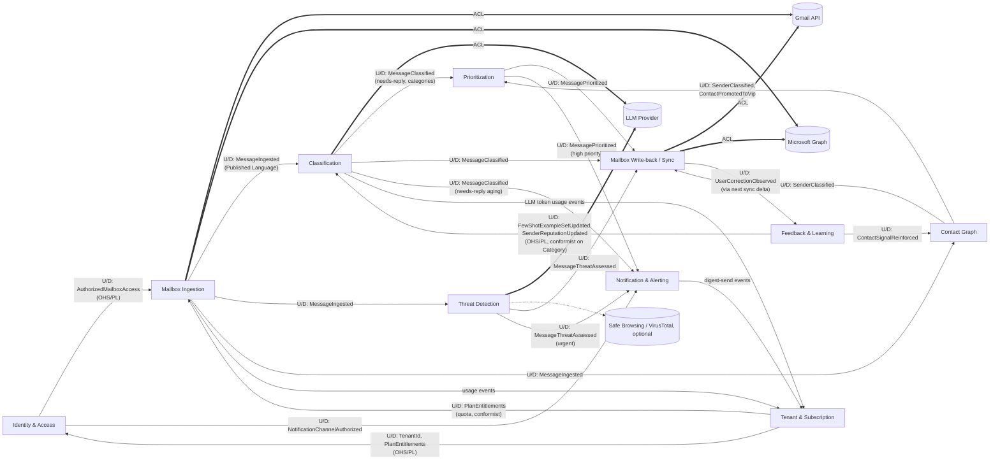

# Context Map — Cross-Platform Email Triage & Classification System

Strategic design for a multi-tenant SaaS that continuously ingests, classifies, prioritizes,
and writes back triage decisions across many tenants' Gmail and/or Outlook mailboxes.
Grounded in `.plans/email-sorting-system-research.md` (hereafter "the research report"),
particularly the tiered rules→LLM pipeline (§2.3) and the recommended architecture (§6).

## Bounded contexts

| # | Context | Type | One-line role |
|---|---|---|---|
| 1 | [Mailbox Ingestion](contexts/mailbox-ingestion.md) | Supporting | Sync Gmail/Outlook into a normalized message stream |
| 2 | [Classification](contexts/classification.md) | Core | Tiered rules→LLM multi-label taxonomy engine |
| 3 | [Prioritization](contexts/prioritization.md) | Core | 0–100 urgency/priority scoring |
| 4 | [Threat Detection](contexts/threat-detection.md) | Core | Phishing/BEC detection and quarantine decisions |
| 5 | [Contact Graph](contexts/contact-graph.md) | Core | Personal-contact and VIP determination |
| 6 | [Feedback & Learning](contexts/feedback-learning.md) | Core | Correction capture, reputation and prompt evolution |
| 7 | [Mailbox Write-back / Sync](contexts/mailbox-writeback.md) | Supporting | Apply decisions back to Gmail labels / Outlook categories |
| 8 | [Identity & Access](contexts/identity-access.md) | Generic | Tenant/user identity, OAuth credential lifecycle |
| 9 | [Tenant & Subscription](contexts/tenant-subscription.md) | Generic (commercial core) | Plans, usage metering, billing events |
| 10 | [Notification & Alerting](contexts/notification-alerting.md) | Supporting | Digests and escalating alerts to the user |

"Core" here means core to the product's competitive value (accuracy of triage). Identity and
Tenant/Subscription are generic-subdomain in DDD terms but commercially load-bearing, so they
get full tactical models rather than being bought off the shelf, per the brief.

## Why choreography, not one "orchestrator" aggregate

The research report's own open decision #2 confirms the taxonomy is **multi-label and
multi-facet**: a single message can simultaneously be e-commerce, needs-a-reply, and
high-priority. Rather than have one context own a monolithic "final verdict" aggregate that
every other context must write into (a synchronization bottleneck and a single point of
coupling), each of Classification, Threat Detection, Contact Graph, and Prioritization
independently classifies its own facet of the same `MessageId` and publishes its own domain
event. Mailbox Write-back subscribes to all four streams and applies each facet to the
platform idempotently and independently — which also lets each facet honor its own latency
SLA (§6, open decision #4: phishing and needs-a-reply demand low latency; e-commerce/social
can ride the Batch API).

## Relationships

Legend: `U/D` = upstream → downstream. `==>` marked "ACL" is an anti-corruption layer boundary
against an external system. Solid arrows are domain-event integration (choreography); none of
these contexts share a database.

## Relationship patterns in detail

| Upstream | Downstream | Pattern | Why |
|---|---|---|---|
| Tenant & Subscription | Identity & Access | Open Host Service / Published Language | Tenant is the root identity; Identity conforms to `TenantId` and reads `PlanEntitlements` to decide how many mailboxes/users a tenant may connect. |
| Identity & Access | Mailbox Ingestion | OHS/PL | Ingestion cannot sync without a live, scope-minimized credential; Identity is the sole issuer/rotator of tokens. |
| Tenant & Subscription | Mailbox Ingestion, Classification | Conformist | Both enforce plan quotas (sync frequency, LLM tier ceilings) as **given**, without negotiating the shape of `PlanEntitlements`. |
| Mailbox Ingestion | Gmail API / Microsoft Graph | Anti-Corruption Layer | Isolates label-vs-folder, watch/Pub-Sub-vs-subscription/delta, and quota-shape differences behind one `MailboxSyncPort`. |
| Mailbox Ingestion | Classification, Threat Detection, Contact Graph | Customer/Supplier via Published Language (`MessageIngested`) | Ingestion has no knowledge of *why* downstream needs a normalized envelope; downstream contexts are the customers who shaped the envelope contract. |
| Classification, Threat Detection | LLM Provider (Claude API) | Anti-Corruption Layer | Isolates provider request/response shape, Batch-vs-interactive pricing/latency tiers, and structured-output schema from the domain model. |
| Classification, Contact Graph | Prioritization | Customer/Supplier | Prioritization's scoring formula (research §2.5) explicitly consumes needs-reply and VIP/interaction signals as inputs — it cannot compute without them, so it is downstream by construction. |
| Classification, Threat Detection, Contact Graph, Prioritization | Mailbox Write-back / Sync | Customer/Supplier (fan-in), each Published Language independent | Write-back is a pure downstream consumer/conformist to four upstream languages; it does not reinterpret or override upstream verdicts. |
| Mailbox Write-back / Sync | Gmail API / Microsoft Graph | Anti-Corruption Layer | Isolates "add label" vs. "set categories + maybe move folder + set importance" from the write-back domain model. |
| Mailbox Write-back / Sync | Feedback & Learning | Customer/Supplier | A user's manual re-label/re-file, observed on the *next* ingestion delta, is the raw material Feedback & Learning turns into a correction record. |
| Feedback & Learning | Classification, Contact Graph | Open Host Service / Published Language, Conformist on `Category` | Feedback publishes updated few-shot sets and reputation/VIP signals; it must speak Classification's `Category` enum and Contact Graph's `ContactClassification` verbatim — it does not define its own competing taxonomy. |
| Threat Detection, Classification, Prioritization | Notification & Alerting | Customer/Supplier | Notification is a pure downstream fan-in that renders upstream verdicts as user-facing alerts/digests; it adds no classification logic of its own. |
| Mailbox Ingestion, Classification, Notification & Alerting | Tenant & Subscription | Customer/Supplier (usage metering) | Billable usage (messages synced, LLM tokens spent, digests sent) flows one way, upstream-to-downstream from the producer's perspective, into Tenant & Subscription's meters — Tenant & Subscription does not dictate how those contexts operate. |

## Shared kernel

None. Every cross-context reference goes through a domain event or an explicitly published
value type (`TenantId`, `MailboxId`, `MessageId`, `Category`) documented in
[ubiquitous-language.md](ubiquitous-language.md) — no context imports another's aggregate
or repository code. Multi-tenant isolation (`TenantId` as a mandatory partition key) is
enforced at the persistence/infrastructure layer beneath every context, not modeled as its
own bounded context.
